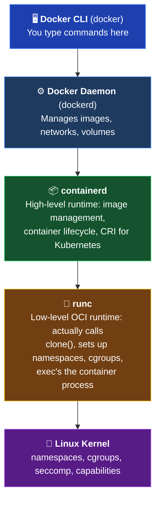

# Chapter 2: Containers Demystified

*"A container is just a Linux process that thinks it's alone on the machine."*

---

## There's No Such Thing as a "Container"

That heading might seem provocative in a Kubernetes book, but it's the most important thing you'll learn in this chapter: **there is no container primitive in the Linux kernel.** There's no `container_create()` system call. No "container" entry in `/proc`.

What we call a "container" is actually a regular Linux process with three extra things applied to it:

1. **Namespaces** — so the process thinks it has its own PID tree, network stack, and filesystem
2. **cgroups** — so the process can only use a defined amount of CPU and memory
3. **A root filesystem** (from an image) — so the process sees a completely different `/` than the host

That's it. If you've ever used `chroot`, you've already used a primitive form of containerization. If you've ever set up cgroups for a service, you've done resource limiting. Docker, containerd, and Kubernetes didn't invent these features — they made them *usable*.

As a Linux professional, you already understand the building blocks. This chapter takes them apart, shows you how they fit together, and reveals what Docker (and eventually Kubernetes) is really doing under the hood.

## Linux Namespaces: The Isolation Layer

Namespaces are the kernel feature that gives a process its own isolated view of the system. Think of them as one-way mirrors: the host can see everything, but the namespaced process only sees its own little world.

Linux provides several namespace types, each isolating a different system resource:

| Namespace | Flag | What It Isolates | Linux Analogy |
|-----------|------|------------------|---------------|
| **PID** | `CLONE_NEWPID` | Process IDs — the container sees its entrypoint as PID 1 | Like a fresh boot where your process is `init` |
| **NET** | `CLONE_NEWNET` | Network interfaces, IP addresses, routing tables, ports | Like a separate machine with its own `eth0` |
| **MNT** | `CLONE_NEWNS` | Mount points — the container has its own filesystem tree | Like `chroot` on steroids |
| **UTS** | `CLONE_NEWUTS` | Hostname and domain name | Like setting a different hostname per service |
| **IPC** | `CLONE_NEWIPC` | Inter-process communication (shared memory, semaphores) | Like separate System V IPC domains |
| **USER** | `CLONE_NEWUSER` | User and group IDs — root inside may not be root outside | Like having a separate `/etc/passwd` per process |
| **cgroup** | `CLONE_NEWCGROUP` | cgroup root directory — the container sees its own cgroup hierarchy as root | Like a private view of `/sys/fs/cgroup/` |

When Docker starts a container, it's calling the same kernel APIs that `unshare` and `clone()` use. The "magic" of containers is just namespace creation — something Linux has supported since kernel 2.6.24 (2008) and that matured with user namespaces in kernel 3.8 (2013).

### How Namespaces Work Together

A typical container combines all seven namespace types. The process inside:
- Sees itself as PID 1 (PID namespace)
- Has its own `lo` and `eth0` interfaces (NET namespace)
- Sees a completely different root filesystem (MNT namespace)
- Has its own hostname (UTS namespace)
- Can't access the host's shared memory (IPC namespace)
- May even think it's running as root, but actually has limited privileges on the host (USER namespace)

From the **host's perspective**, that same process is just another entry in `ps aux` with a regular PID. There's nothing special about it — it's a normal Linux process with some extra kernel metadata restricting what it can see.

## cgroups v2: The Resource Limiter

While namespaces handle **isolation** (what a process can see), cgroups handle **resource limits** (what a process can use). cgroups — short for "control groups" — let you set hard boundaries on CPU, memory, I/O, and more.

Modern Linux systems use **cgroups v2** (unified hierarchy), which organizes resource control under a single tree at `/sys/fs/cgroup/`. Here's what the key controllers do:

| Controller | Interface File | What It Controls |
|-----------|---------------|-----------------|
| **CPU** | `cpu.max` | Maximum CPU time (quota/period in microseconds) |
| **CPU** | `cpu.weight` | Proportional CPU share (replaces v1's `cpu.shares`) |
| **Memory** | `memory.max` | Hard memory limit — OOM-killed if exceeded |
| **Memory** | `memory.low` | Best-effort memory protection (soft guarantee) |
| **I/O** | `io.max` | Per-device I/O rate limits (bytes/s, IOPS) |
| **PIDs** | `pids.max` | Maximum number of processes in the group |

When you run `docker run --memory=128m --cpus=0.5`, Docker is doing exactly this behind the scenes:
- Writing `134217728` (128 MB in bytes) to `memory.max`
- Writing `50000 100000` to `cpu.max` (50ms of CPU every 100ms = 0.5 CPUs)

There's no Docker magic here — it's plain kernel interfaces.

## OCI Images: Immutable, Layered Filesystems

Now that we've covered isolation (namespaces) and resource limits (cgroups), the third piece is the **filesystem**. A container needs to see a root filesystem (`/`) with all its binaries, libraries, and config files. That's what an OCI (Open Container Initiative) image provides.

### How Layers Work

An image isn't a single file — it's a stack of **read-only layers**, each representing a set of filesystem changes. Think of it like version control for filesystems:

```
Layer 4: COPY app.py /app/           ← Your application code
Layer 3: RUN pip install flask        ← Installed packages
Layer 2: RUN apt-get install python3  ← Python runtime
Layer 1: FROM ubuntu:24.04            ← Base OS filesystem
```

Each layer only stores the **diff** from the layer below it. This design has huge advantages:

- **Shared layers**: If 10 containers all use `ubuntu:24.04`, that base layer is stored once on disk and shared across all of them
- **Fast builds**: Change your app code? Only Layer 4 gets rebuilt — layers 1-3 are cached
- **Immutability**: Layers are read-only. When a container writes files, those writes go to a thin **writable layer** on top (using a union filesystem like OverlayFS)

### The Dockerfile: Building Images

A Dockerfile is a recipe for building an image, layer by layer. Here are the key instructions:

| Instruction | Purpose | Linux Analogy |
|-------------|---------|---------------|
| `FROM` | Sets the base image (starting filesystem) | Like choosing which distro to install |
| `RUN` | Executes a command during build (creates a new layer) | Like running a command in a provisioning script |
| `COPY` | Copies files from your machine into the image | Like `cp` or `scp` during setup |
| `ENV` | Sets environment variables | Like adding to `/etc/environment` |
| `EXPOSE` | Documents which port the app listens on | Like a comment in your firewall config (doesn't actually open ports) |
| `CMD` | Default command when the container starts | Like `ExecStart=` in a systemd unit |
| `ENTRYPOINT` | The main executable (CMD becomes its arguments) | Like the binary path in `ExecStart=`, with CMD as the arguments |

**Important distinction:** `CMD` provides defaults that can be overridden at runtime (`docker run myimage /bin/sh`). `ENTRYPOINT` sets the executable that always runs, and `CMD` just provides default arguments to it. Most production images use `ENTRYPOINT` for the main binary and `CMD` for default flags.

## Container Runtimes: The Stack

When you run `docker run nginx`, a surprising number of components are involved. Understanding the stack helps demystify what's actually happening:



Here's the key insight: **Kubernetes doesn't use Docker.** Since Kubernetes v1.24, Docker support (dockershim) was removed. Kubernetes talks directly to **containerd** via the Container Runtime Interface (CRI). containerd then uses **runc** to create the actual container process.

Docker is a development tool. containerd is the production runtime. runc is the engine that talks to the kernel. Understanding this stack matters because when you troubleshoot container issues in Kubernetes, you're debugging containerd and runc — not Docker.

## Linux ↔ Container Comparison Table

| Linux Concept | Container Equivalent | How It Maps |
|---------------|---------------------|-------------|
| `chroot` | Mount namespace + rootfs | Containers use a complete mount namespace, not just a changed root |
| `unshare` | Namespace creation | Docker/runc calls `clone()` with namespace flags, just like `unshare` |
| cgroups (`/sys/fs/cgroup/`) | Resource limits (`--memory`, `--cpus`) | Same kernel feature — Docker just writes to cgroup files for you |
| Process (`/proc/<pid>/`) | Container | A container *is* a process — it has a PID on the host |
| Filesystem (`/`, `/usr`, `/etc`) | Image layers (OverlayFS) | Layered and read-only, unlike a traditional mutable filesystem |
| PID 1 (`init`/`systemd`) | Container entrypoint | The entrypoint process must stay running — if it exits, the container stops |
| `fork()`/`exec()` | `docker run` | Creates a new process with isolation, just with more steps |

> **Where the Linux Analogy Breaks**
>
> - **Images are immutable and layered.** On a Linux server, you can modify any file in-place. Container images are built from read-only layers — runtime writes go to a separate writable layer that's discarded when the container stops. This immutability is a feature, not a limitation: it guarantees that every container from the same image starts identically.
>
> - **The entrypoint must stay running.** On a Linux server, if a service crashes, systemd restarts it. In a container, if PID 1 exits, the container dies immediately. There's no init system inside to restart it. (That's Kubernetes' job — it restarts the *container*, not the process inside it.)
>
> - **Networking is completely isolated by default.** Host processes share the same network stack — they can all bind to ports, see the same interfaces, and reach each other via `localhost`. A container gets its own network namespace with its own interfaces. To reach the container from the host, you need explicit port mapping (`-p 8080:80`) or a container network.

## Diagnostic Lab: Containers from Scratch

This lab shows you that containers are just Linux features — no magic required. You'll create namespaces manually, build an image, inspect its layers, and prove that containers are just processes.

### Prerequisites

- A Linux machine (or WSL2 on Windows)
- Docker installed and running
- Root or sudo access (for the `unshare` section)

### Exercise 1: Create a Namespace Manually

This exercise proves that "containers" are just Linux kernel features. We'll use `unshare` to create isolated namespaces — the same thing Docker does under the hood.

**Create a new PID and mount namespace:**

```bash
sudo unshare --pid --mount --fork bash
```

Inside this new namespace, you're in an isolated PID space. Let's prove it:

```bash
# Mount a fresh /proc for this PID namespace
mount -t proc proc /proc

# Check — your shell is PID 1 in this namespace!
echo $$

# List all processes — you'll only see processes in THIS namespace
ps aux
```

You should see very few processes — just your shell and `ps` itself. Meanwhile, on the host (in another terminal), the full process list is visible. This is exactly what a container sees.

**Exit the namespace:**

```bash
exit
```

> **What just happened?** You used `unshare` to create new PID and mount namespaces — the same kernel features that Docker and containerd use. The only difference is that Docker also sets up cgroups, networking, an image-based root filesystem, and does it all through a convenient API.
>
> **Source:** [unshare(1) — Linux manual page](https://man7.org/linux/man-pages/man1/unshare.1.html)

### Exercise 2: Build a Docker Image

Create a working directory and a simple Dockerfile:

```bash
mkdir -p ~/container-lab && cd ~/container-lab
```

Create a Dockerfile:

```dockerfile
FROM ubuntu:24.04
RUN apt-get update && apt-get install -y curl && rm -rf /var/lib/apt/lists/*
COPY <<EOF /app/hello.sh
#!/bin/bash
echo "Hello from container! Hostname: $(hostname), PID: $$"
sleep infinity
EOF
RUN chmod +x /app/hello.sh
CMD ["/app/hello.sh"]
```

Build the image:

```bash
docker build -t my-container-lab:v1 .
```

> **Source:** [Dockerfile reference](https://docs.docker.com/reference/dockerfile/)

### Exercise 3: Inspect Image Layers

Every Dockerfile instruction that modifies the filesystem creates a new layer. Let's see them:

```bash
# Show the layer history — each line is a layer
docker history my-container-lab:v1
```

You'll see each layer with its size and the command that created it. Notice how `FROM ubuntu:24.04` is the largest layer and your `COPY` command is tiny.

Now inspect the full image metadata:

```bash
# Show detailed image information including layer digests
docker inspect my-container-lab:v1 --format '{{json .RootFS.Layers}}' | python3 -m json.tool
```

Each SHA256 hash represents a layer. Images sharing the same base image will share the same bottom layers — that's how Docker saves disk space.

> **Source:** [docker history](https://docs.docker.com/reference/cli/docker/image/history/) | [docker inspect](https://docs.docker.com/reference/cli/docker/inspect/)

### Exercise 4: Resource Limits with cgroups

Run a container with memory and CPU limits — Docker translates these to cgroup settings:

```bash
docker run -d --name limited-container \
  --memory=128m \
  --cpus=0.5 \
  my-container-lab:v1
```

Now inspect the cgroup limits that Docker configured:

```bash
# Check the memory limit (in bytes — 128MB = 134217728)
docker exec limited-container cat /sys/fs/cgroup/memory.max

# Check the CPU quota (50000 100000 = 50ms every 100ms = 0.5 CPUs)
docker exec limited-container cat /sys/fs/cgroup/cpu.max
```

These are the same cgroup files you'd write to manually on the host. Docker just provides a convenient interface.

Clean up:

```bash
docker stop limited-container && docker rm limited-container
```

> **Source:** [docker run — resource constraints](https://docs.docker.com/reference/cli/docker/container/run/#memory) | [cgroups v2 — Linux kernel docs](https://www.kernel.org/doc/html/latest/admin-guide/cgroup-v2.html)

### Exercise 5: Containers Are Just Processes

This is the "aha moment." Run a container and prove it's just a process on the host:

```bash
# Run a container
docker run -d --name process-proof my-container-lab:v1

# Inside the container, the entrypoint is PID 1
docker exec process-proof ps aux
```

Now look at the **host's** process list:

```bash
# Find the container's process on the HOST — it has a regular PID!
docker top process-proof
```

The `docker top` output shows the container's processes as the **host sees them** — with real host PIDs. The container process thinks it's PID 1, but the host knows its actual PID.

You can even find it with plain `ps`:

```bash
# Get the container's PID on the host
docker inspect process-proof --format '{{.State.Pid}}'

# Verify — this is a regular process visible on the host
ps -p $(docker inspect process-proof --format '{{.State.Pid}}') -o pid,ppid,cmd
```

**This is the fundamental revelation:** A container is not a VM. It's not a separate kernel. It's a Linux process with namespaces and cgroups applied. The host kernel runs everything.

Clean up:

```bash
docker stop process-proof && docker rm process-proof
rm -rf ~/container-lab
```

> **Source:** [docker top](https://docs.docker.com/reference/cli/docker/container/top/) | [docker inspect](https://docs.docker.com/reference/cli/docker/inspect/)

## Key Takeaways

1. **A container is a Linux process** with namespaces (isolation), cgroups (resource limits), and an image-based root filesystem. There's no kernel-level "container" primitive.
2. **Linux namespaces** provide six types of isolation: PID, NET, MNT, UTS, IPC, and USER. Each hides a different aspect of the host system from the containerized process.
3. **cgroups v2** enforce resource boundaries. When you set `--memory=128m`, Docker writes to the same `/sys/fs/cgroup/memory.max` file you could write to manually.
4. **OCI images are layered and immutable.** Each Dockerfile instruction creates a read-only layer. Shared base layers save disk space, and immutability guarantees consistent deployments.
5. **The container runtime stack is Docker CLI → dockerd → containerd → runc → Linux kernel.** Kubernetes skips Docker entirely and talks to containerd via CRI.
6. **Container entrypoints are PID 1.** If the entrypoint process exits, the container stops. There's no init system inside to restart services — that responsibility shifts to the orchestrator (Kubernetes).
7. **Understanding these Linux foundations gives you a debugging superpower.** When a container misbehaves, you're not fighting magic — you're debugging namespaces, cgroups, and process behavior, which you already understand.

## Further Reading

- [Linux Namespaces — man7.org](https://man7.org/linux/man-pages/man7/namespaces.7.html)
- [unshare(1) — Linux manual page](https://man7.org/linux/man-pages/man1/unshare.1.html)
- [Control Group v2 — Linux kernel docs](https://www.kernel.org/doc/html/latest/admin-guide/cgroup-v2.html)
- [OCI Image Specification](https://github.com/opencontainers/image-spec)
- [OCI Runtime Specification](https://github.com/opencontainers/runtime-spec)
- [Dockerfile Reference](https://docs.docker.com/reference/dockerfile/)
- [containerd — CNCF Project](https://containerd.io/)
- [Docker CLI Reference](https://docs.docker.com/reference/cli/docker/)

---

**Previous:** [Chapter 1 — From Server to Cluster](01-from-server-to-cluster.md)

**Next:** [Chapter 3 — Kubernetes Architecture](03-kubernetes-architecture.md) — The control plane and worker node components, mapped to the Linux services and daemons you already know.
